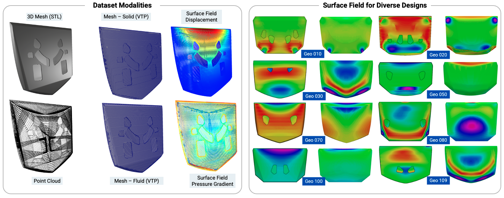

# AutoHood3D

**A Multi‑Modal Benchmark for Automotive Hood Design and Fluid–Structure Interaction**

> AutoHood3D is an open‑source dataset and framework comprising over 16 000 parametric hood geometries with coupled high‑fidelity LES–FEA simulations. 
It supports CAD‑driven generative‑AI, surrogate modeling, physics‑informed ML, and LLM fine‑tuning. 




---

## 🛠️ REPOSITORY UPDATES
2025‑05‑10 v1.0 initial public release: 16 000+ geometries, full end‑to‑end pipeline

---

##  ⚖️ License

Shield: [![CC BY-NC 4.0][cc-by-nc-shield]][cc-by-nc]

This work is licensed under a
[Creative Commons Attribution-NonCommercial 4.0 International License][cc-by-nc].
**Licensing note:** The dataset is licensed under **CC BY-NC 4.0**, and the code is licensed under the **PolyForm Noncommercial License 1.0.0**. For commercial usage, please contact the authors.

[![CC BY-NC 4.0][cc-by-nc-image]][cc-by-nc]

[cc-by-nc]: https://creativecommons.org/licenses/by-nc/4.0/
[cc-by-nc-image]: https://licensebuttons.net/l/by-nc/4.0/88x31.png
[cc-by-nc-shield]: https://img.shields.io/badge/License-CC%20BY--NC%204.0-lightgrey.svg

---

## 📥 Dataset Access

- **Harvard Dataverse**: 
	- Base Hood Skins:  [https://doi.org/10.7910/DVN/9268BB](https://doi.org/10.7910/DVN/9268BB) 
	
	- Dataset 4k Hoods STLs: [https://doi.org/10.7910/DVN/HEILMB](https://doi.org/10.7910/DVN/HEILMB)    
	- Dataset 4k Hoods Sim Data: [https://doi.org/10.7910/DVN/VCKOK5](https://doi.org/10.7910/DVN/VCKOK5)  
	- ML-PreSplit for 4k Hoods: [https://doi.org/10.7910/DVN/6OAFF8](https://doi.org/10.7910/DVN/6OAFF8)  
	- ML (Graph)-PreSplit for 4k Hoods: [https://doi.org/10.7910/DVN/WODNWY](https://doi.org/10.7910/DVN/WODNWY)
	- Test ML Workflow for 100 Hoods (from 4k set): [https://doi.org/10.7910/DVN/FSYRJA](https://doi.org/10.7910/DVN/FSYRJA)
	
	- Dataset 12k Hoods STLs: [https://doi.org/10.7910/DVN/Z0VXLI](https://doi.org/10.7910/DVN/Z0VXLI) 
	- Dataset 12k Hoods SimData A (around 0.7TB) : [https://doi.org/10.7910/DVN/BVPATN](https://doi.org/10.7910/DVN/BVPATN)
	- Dataset 12k Hoods SimData B (around 0.7TB) : [https://doi.org/10.7910/DVN/UDXEG9](https://doi.org/10.7910/DVN/UDXEG9)
	
	- Dataset 12k Hoods STLs (random): [https://doi.org/10.7910/DVN/OJXIS1](https://doi.org/10.7910/DVN/OJXIS1) 
	 

- **LLM SFT Prompts for Point Clouds**:
	 - 06_LLM_Generation/Final_consolidated_prompts.jsonl
---

## 📂 Directory Structure

- 00_Base_Hoods_and_Curves # Raw CAD and curve libraries
- 01_Generating_Hoods # Convex‐hull, segmentation & shell reconstruction
- 02_HPC_Automation # Scripts for case setup & SLURM orchestration
- 03_FSI_Solvers # Custom UM_pimpleFoam & UM_solidDisplacementFoam
- 04_Preprocessing_data_for_ML # Mesh‐to‐point/cloud conversion & feature extraction
- 05_ML_Framework # Training & evaluation pipelines for surrogate models
- 06_LLM_Generation # Prompt generation & LLM fine‑tuning scripts
- 07_Postprocessing # Visualization and benchmark plots
- CroissantData # JSON descriptors for Dataset Metadata

---

## 🚀 Quick Start

1. **Clone the repo**  
 ```bash
   git clone https://github.com/YourOrg/AutoHood3D.git
   cd AutoHood3D
```

2. Install dependencies

 ```bash
 pip install -r 05_ML_Framework/package.list
# plus OpenFOAM v2312, preCICE v3.1.2, preCICE OpenFOAM adapter v1.3.0
```

3. Run 
- Generate shell variants: python 01_Generating_Hoods/...
- Launch FSI co‑simulation: see 02_HPC_Automation/...
- Preprocess for ML: python 04_Preprocessing_data_for_ML/...
- Train surrogate models: python 05_ML_Framework/...
- Fine‑tune LLM: python 06_LLM_Generation/...
- Plot results: python 07_Postprocessing/viz...

NOTES :
Each folder contains separate instructions, please check README files. 

---

## 🤝 Contributing
Issues and pull requests welcome via GitHub.

---

## 📬 Contact
**Authors:** 
    - Vansh Sharma, Harish Jai Ganesh, Maryam Akram, Wanjiao Liu and Venkat Raman
    - Email at: vanshs@umich.edu and ramanvr@umich.edu

**Research Group:**
    - [Advanced Propulsion Concepts Lab](https://sites.google.com/umich.edu/apcl/home?authuser=0)  
    - Department of Aerospace Engineering, University of Michigan, Ann Arbor

---


